# Decentralizirano glasanje — Web 3.0 aplikacija

## Opis projekta

Ova aplikacija predstavlja **decentralizirani sustav za glasanje** izgrađen korištenjem **Ethereum blockchaina** i **Vue 3** za frontend. Glasanje je sigurno, transparentno i nepromjenjivo zahvaljujući blockchain tehnologiji.

Projekt omogućava:
- Dodavanje i brisanje kandidata (admin).
- Pokretanje i zaustavljanje procesa glasanja (admin).
- Glasanje korisnika (jedan glas po korisniku).
- Automatsko određivanje pobjednika.
- Preuzimanje rezultata glasanja u **CSV** formatu.

---

## Tehnologije
- **Frontend**: Vue 3
- **Pametni ugovori**: Solidity 0.8.x
- **Blockchain komunikacija**: Ethers.js
- **Razvojno okruženje**: Hardhat (lokalna mreža)
- **Wallet integracija**: MetaMask

---

## Struktura projekta

```
glasanje-frontend/
├── src/
│   ├── contracts/
│   │   ├── abi.js
│   │   └── contract-address.json
│   └── components/
│       └── Glasanje.vue
├── contracts/
│   └── DecentraliziranoGlasanje.sol
├── scripts/
│   └── deploy.js
├── package.json
└── vite.config.js
```

---

## Funkcionalnosti

### Pametni ugovor `DecentraliziranoGlasanje.sol`

- `dodajKandidata(string _ime)` — dodavanje kandidata.
- `obrisiKandidata(uint id)` — brisanje kandidata po ID-u.
- `obrisiKandidate()` — brisanje svih kandidata.
- `pokreniGlasanje()` — pokretanje procesa glasanja.
- `zaustaviGlasanje()` — završavanje glasanja i određivanje pobjednika.
- `glasaj(uint kandidatId)` — glasanje za odabranog kandidata.
- `dohvatiSveKandidate()` — dohvat liste svih kandidata.
- `dohvatiZadnjegPobjednika()` — dohvat posljednjeg pobjednika.

### Frontend funkcionalnosti

- **Admin panel**:
  - Dodavanje i brisanje kandidata.
  - Pokretanje i zaustavljanje glasanja.
- **Korisničko sučelje**:
  - Pregled svih kandidata i trenutnih rezultata.
  - Glasanje (jedan glas po korisniku).
  - Pregled pobjednika nakon zatvaranja glasanja.
  - Preuzimanje rezultata u **CSV** formatu.

### Ažuriranje podataka

- Umjesto event listenera, koristi se **setInterval** mehanizam:
  - Periodičko provjeravanje statusa glasanja i liste kandidata svakih **1 sekundu**.
  - Pruža gotovo real-time ažuriranje bez potrebe za ručnim osvježavanjem stranice.
  - Prosječno kašnjenje prikaza: 5–10 sekundi zbog prirode blockchain potvrda.

---

## Pokretanje projekta

### 1. Pokretanje lokalnog blockchaina (Hardhat)

```bash
npx hardhat node
```

### 2. Deploy pametnog ugovora

```bash
npx hardhat run scripts/deploy.js --network localhost
```

### 3. Pokretanje frontend aplikacije

```bash
cd glasanje-frontend
npm install
npm run dev
```

Aplikacija će biti dostupna na:
```
http://localhost:5173/
```

---

## Preuzimanje rezultata

Nakon završetka glasanja:
- Prikazuje se pobjednik.
- Omogućeno je preuzimanje rezultata glasanja u **CSV** formatu klikom na gumb **"Preuzmi rezultate"**.

---

## Zaključak

Ova aplikacija demonstrira izradu decentraliziranog sustava za glasanje koristeći blockchain tehnologiju. Korištenjem principa Web 3.0 omogućena je transparentnost, sigurnost i nepromjenjivost podataka.

Važno je naglasiti da sustav nije u potpunosti decentraliziran jer postoji uloga **administratora**. Administrator ima ovlasti za dodavanje i uklanjanje kandidata, te pokretanje i zaustavljanje glasanja. Ova minimalna razina kontrole je nužna kako bi se osiguralo pravilno upravljanje glasovanjem — glasanje se ne može samo od sebe pokrenuti niti zaustaviti bez upravljanja, što je ključno za funkcionalnost sustava.

Također, svjestan sam da performanse aplikacije nisu idealne te da postoji vremensko kašnjenje od nekoliko sekundi između transakcije i prikaza rezultata. Ovo kašnjenje je očekivano zbog prirode blockchain mreža i vremena potrebnog za potvrdu transakcija. Ipak, primarni cilj ovog projekta je demonstrirati **primjenu blockchain tehnologije** u izgradnji transparentnog i sigurnog sustava za elektroničko glasanje.

---

## Slike
Adminov prikaz
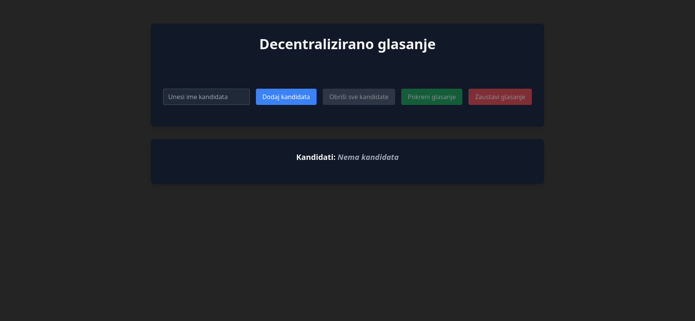

Dodavanje kandidata (za druge radnje se isto izvodi transakcija ali se ne nalaze u slikama)
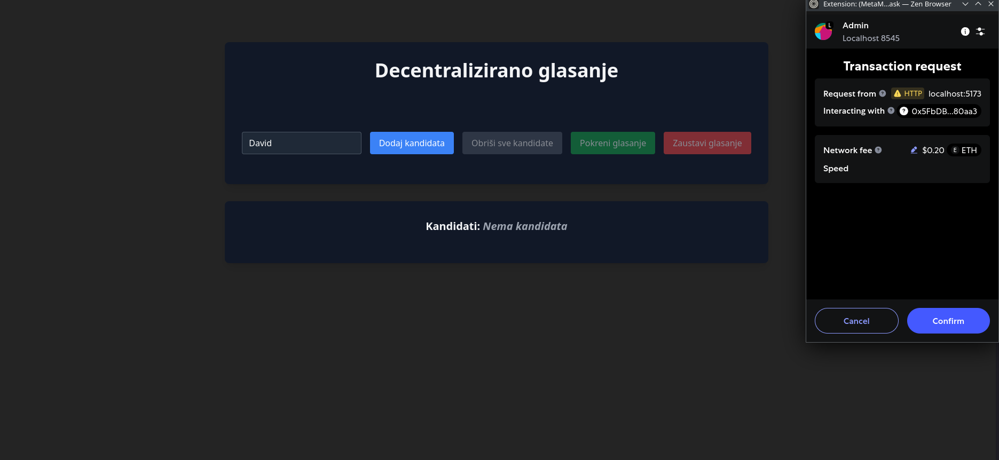

Kandidat je dodan
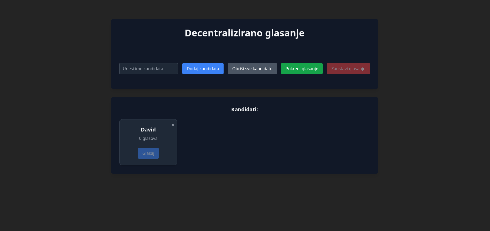

Dodan je još jedan kandidat
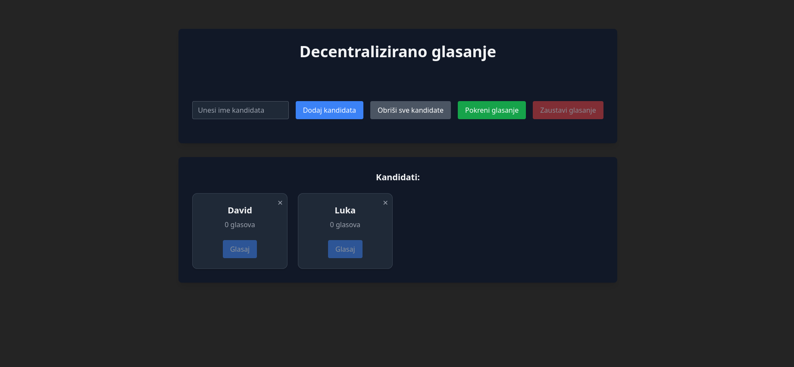

Pokrenuto je glasanje (admin isto može glasati)
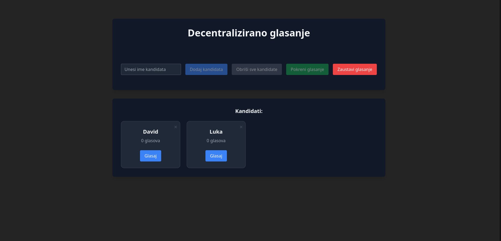

Korisnikov prikaz (kandidati su prikazani tek kada je glasanje pokrenuto)
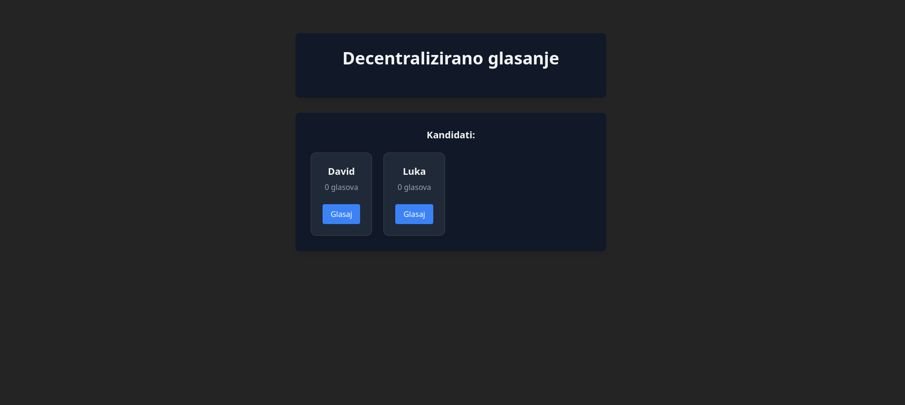

Korisnik je glasao te su gumbovi za glasanje sada disabled.
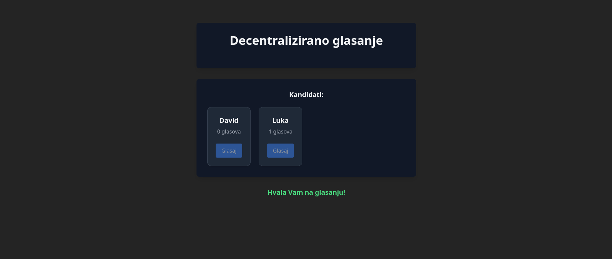

Adminov prikaz gdje vidimo da se korisnikov glas učitao (bez potrebe da se web stranica refresha)
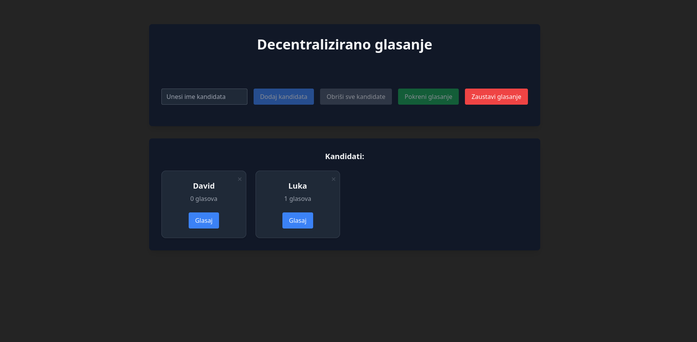

Admin glasa
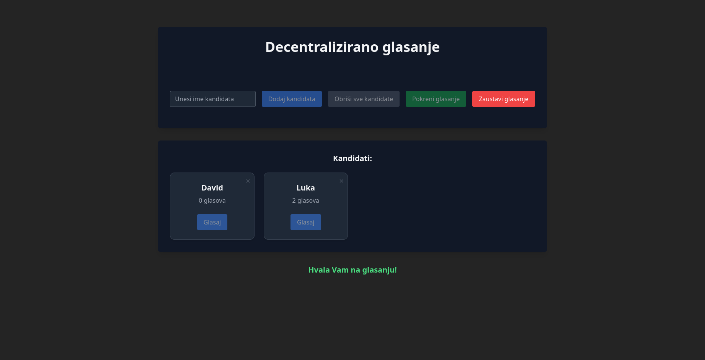

Korisnik vidi da je netko isto glasao. Implementirano glasanje je tip glasanja u kojem svatko može vidjeti trenutačno stanje. U ovim slikama sam koristio admina i jednog korisnika ali može se imati veći broj korisnika.
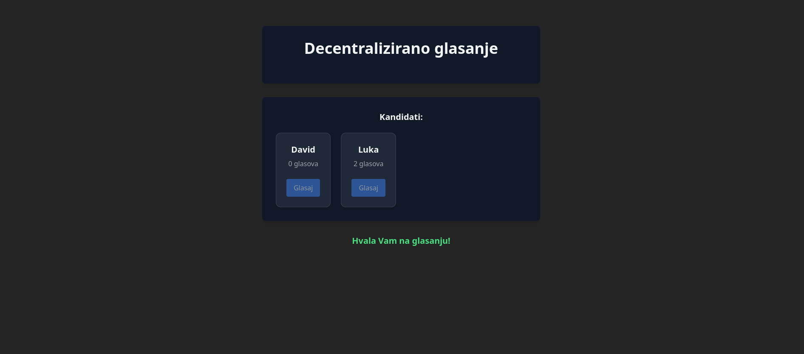

Admin zaustavlja glasanje te se prikazuje pobjednik te gumb za preuzimanje rezultata. U slučaju da ima više vodećih kandidata s jednakim brojem glasova onda pobjeđuje onaj koji je prvi dobio taj vodeći broj glasova. Prilikom zaustavljanja glasanja se prošli kandidati briše te se mogu dodati novi kandidati te se to gleda kao novo glasanje. 
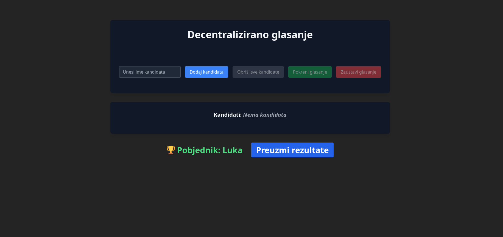
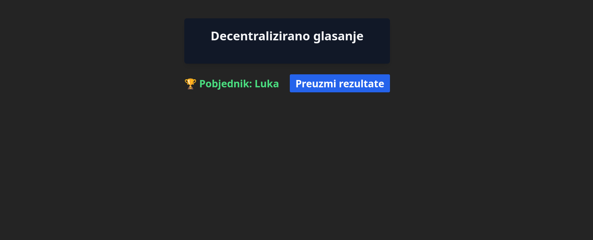

Prikaz csv-a rezultata
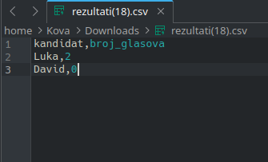

Dodavanje novog kandiata te samim time će se moći pokrenuti novo glasanje
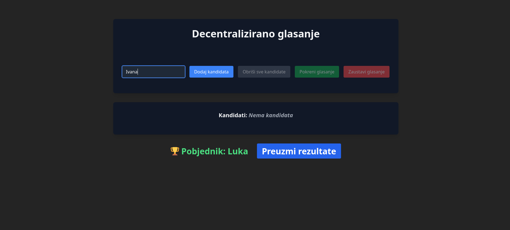
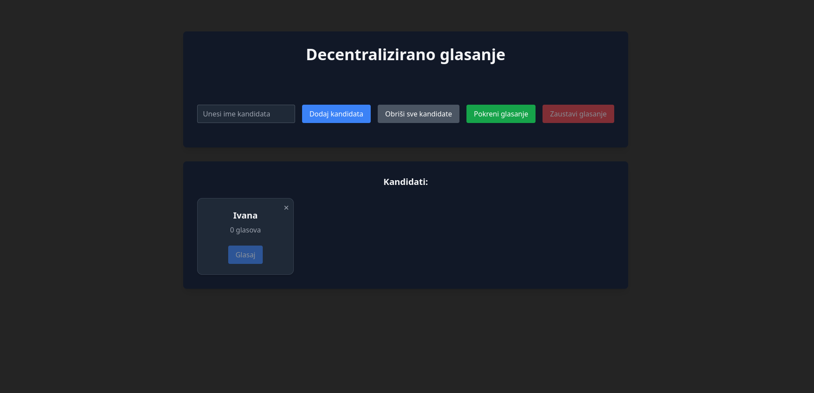

Prikaz mogućnosti kapaciteta za više kandidata
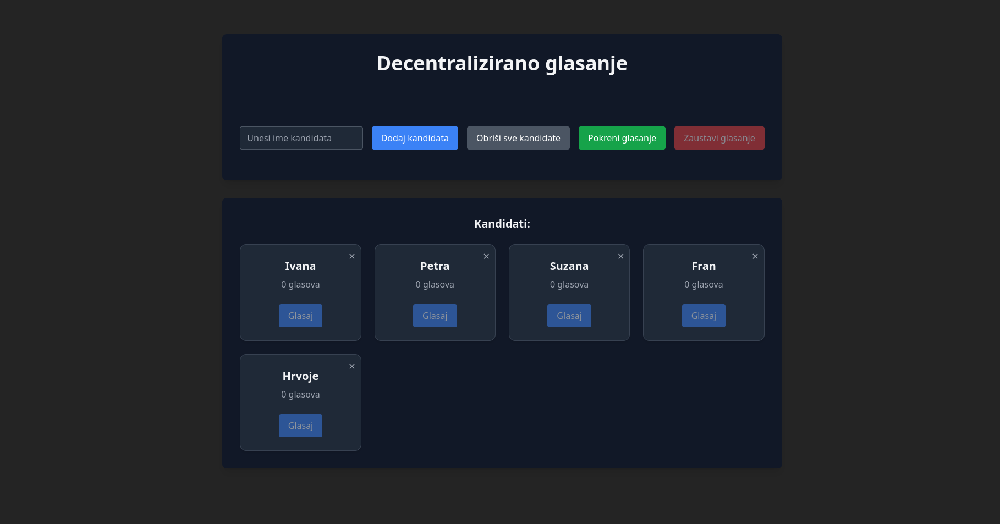

Nazivi kandidata se ne smiju u tom glasanju ponavljati
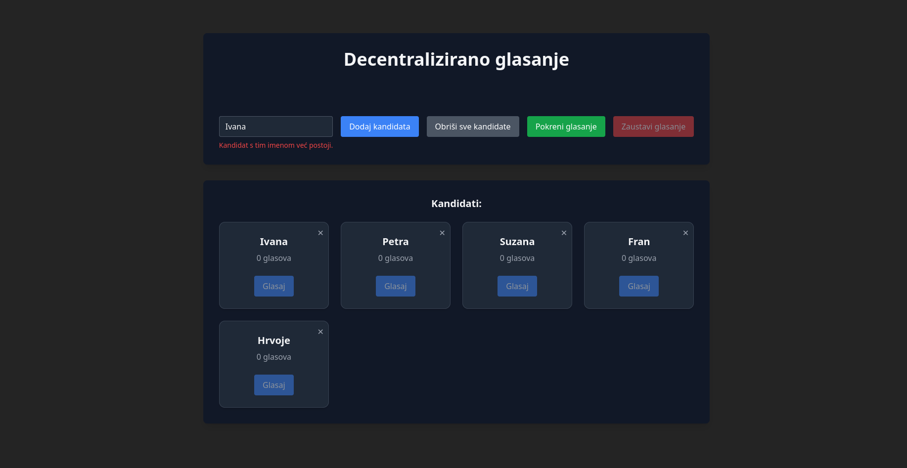

Brisanje jednog kandidata (Suzana) klikom na "x" kod kandidata
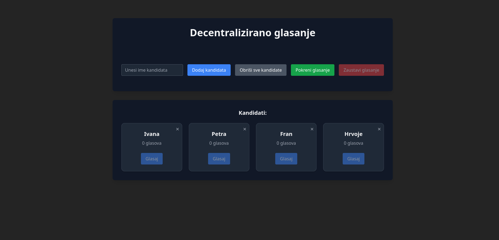

Brisanje svih kandidata
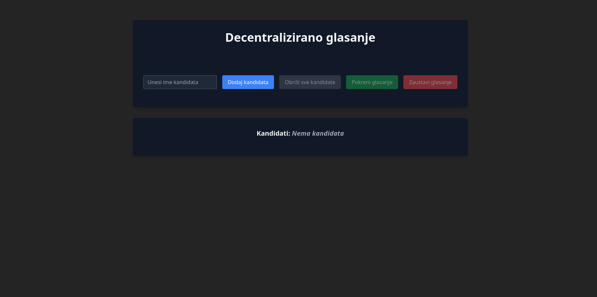